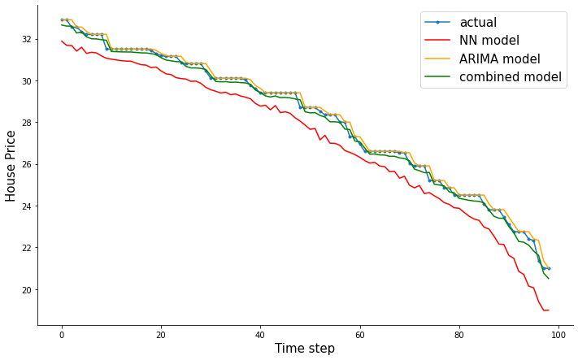

# The Combined Forecasting Model For Time Series 

In this work, I want to reproduce my bachelor thesis work into a Python version and describe it in English

## Objectives
This work wants to improve the accuracy of housing price prediction using a combined model that integrates the advantages of both ARIMA and NN models.

## Method
1. Univariate Time-series prediction via Neural Network (NN) in ```TensorFlow```.
2. Univariate Time-series prediction via Autoregressive integrated moving average (ARIMA) in ```statsmodels```.
3. Combining these two models into one using the inverse-variance weighting method. 

## Dataset
https://www.kaggle.com/datasets/yasserh/housing-prices-dataset?select=Housing.csv

## Code
[programming](programming.ipynb)

## Conclusion



